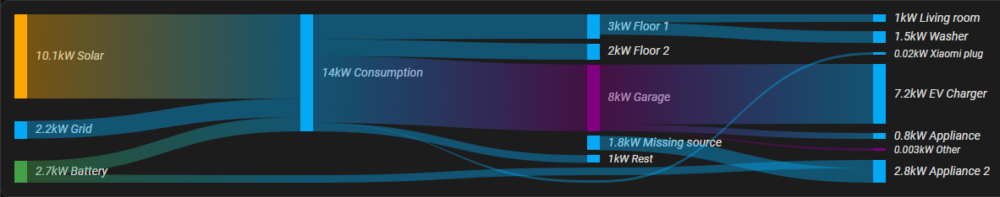
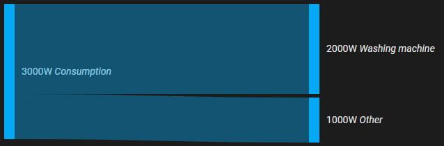
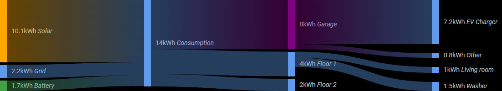

# Sankey Chart Card

A Home Assistant lovelace card to display a sankey chart. For example for energy/power/water consumption.

[![GitHub Release][releases-shield]][releases]
[![License][license-shield]](LICENSE.md)
[](https://github.com/hacs/integration)

![Project Maintenance][maintenance-shield]
[![GitHub Activity][commits-shield]][commits]

[](https://www.buymeacoffee.com/mindfreeze)

This card is intended to display connections between entities with numeric state. It is not a general graph card.



## Installation

Install through [HACS](https://hacs.xyz/)

## Options

| Name              | Type    | Default             | Description                                 |
| ----------------- | ------- | ------------------- | ------------------------------------------- |
| type              | string  |                     | `custom:sankey-chart`
| autoconfig        | object  |                     | Experimental. See [autoconfig](#autoconfig)
| sections          | list    |                     | Required unless using autoconfig. Entities to show divided by sections, see [sections object](#sections-object) for additional options.
| layout            | string  | auto                | Valid options are: 'horizontal' - flow left to right, 'vertical' - flow top to bottom & 'auto' - determine based on available space (based on the section->`min_witdh` option, which defaults to 150)
| energy_date_selection | boolean | false           | Integrate with the Energy Dashboard. Filters data based on the [energy-date-selection](https://www.home-assistant.io/dashboards/energy/) card. Use this only for accumulated data sensors (energy/water/gas) and with a `type:energy-date-selection` card. You still need to specify all your entities as HA doesn't know exactly how to connect them but you can use the general kWh entities that you have in the energy dashboard. In the future we may use areas to auto configure the chart. Not compatible with `time_period`
| title             | string  |                     | Optional header title for the card
| unit_prefix       | string  |                     | Metric prefix for the unit of measurment. See <https://en.wikipedia.org/wiki/Unit_prefix> . Supported values are m, k, M, G, T
| round             | number  | 0                   | Round the value to at most N decimal places. May not apply to near zero values, see issue [#29](https://github.com/MindFreeze/ha-sankey-chart/issues/29)
| height            | number  | 200                 | The height of the card in pixels. Only matters while in horizontal layout. Vertical layout height is dynamic based on content
| wide              | boolean | false               | Set this to true if you see extra empty space on the right side of the card. This will expand it horizontally to cover all the available space. Only relevant in horizontal mode.
| show_icons        | boolean | false               | Display entity icons
| show_names        | boolean | false               | Display entity names
| show_states       | boolean | true                | Display entity states
| show_units        | boolean | true                | Display unit of measurement
| min_box_size      | number  | 3                   | Minimum size of an entity box
| min_box_distance  | number  | 5                   | Minimum space between entity boxes
| min_state         | number  | >0                  | Any entity below this value will not be displayed. Only positive numbers above 0 are allowed. The default is to show everything above 0.
| throttle          | number  |                     | Minimum time in ms between updates/rerenders
| static_scale      | number  |                     | State value corresponding to the maximum size (height for horizontal layout and width in vertical) of the card. For example, if this is set to 1000, then a box with state 500 will take up half of its section. If some section exceeds the value of `static_scale`, the card will dynamically rescale overriding this option. See (#153)
| convert_units_to  | string  |                     | If entities are electricity (kWh) or gas (ft³) usage, convert them to energy (MJ), cost (monetary) or carbon (gCO2). For cost, you must also specify `electricity_price` and/or `gas_price`, as well as the `monetary_unit` of the price(s). For gCO2, all kWh values will be multiplied by the varying grid CO2 intensity, as with the Energy Dashboard.
| co2_intensity_entity |string | sensor. co2_signal_co2_intensity | Entity providing carbon intensity of electricity (gCO2eq/kWh). If you have solar or storage, you may wish to create a template sensor to convert grid CO2 intensity to consumption CO2 intensity.
| gas_co2_intensity | number  | 66.6 g/ft³ or 2352 g/m³ | Carbon intensity of gas, e.g. in gCO2eq/ft³. Default value depends on locale; units must match those of gas entities.
| electricity_price | number  |                     | Unit price of electricity, e.g. in USD/kWh. Automatic conversion does not support varying electricity prices like the Energy Dashboard does.
| gas_price         | number  |                     | Unit price of gas, e.g. in USD/ft³.
| monetary_unit     | string  |                     | Currency of the gas or electricity price, e.g. 'USD'
| sort_by           | string  |                     | Sort the entities. Valid options are: 'state'. If your values change often, you may want to use the `throttle` option to limit update frequency
| sort_dir          | string  | desc                | Sorting direction. Valid options are: 'asc' for smallest first & 'desc' for biggest first
| time_period_from | string  |                      | Start of custom time period (e.g., "now-1d", "now/d"). Not compatible with `energy_date_selection`. See [Time period](#time-period)
| time_period_to   | string  | now                  | End of custom time period. Not compatible with `energy_date_selection`. See [Time period](#time-period)
| ignore_missing_entities | boolean | false         | If true, missing entities will be treated as having a state of 0 instead of throwing an error |

### Sections object

| Name              | Type    | Requirement  | Default             | Description                                 |
| ----------------- | ------- | ------------ | ------------------- | ------------------------------------------- |
| entities          | list    | **Required** |                     | Entities to show in this section. Could be just the entity_id as a string or an object, see [entities object](#entities-object) for additional options. Note that the order of this list matters
| sort_by           | string  | **Optional** |                     | Sort the entities in this section. Overrides the top level option
| sort_dir          | string  | **Optional** | desc                | Sorting direction for this section. Overrides the top level option
| sort_group_by_parent | boolean | **Optional** | false            | Group entities by parent before sorting. See [#135](https://github.com/MindFreeze/ha-sankey-chart/issues/135)
| min_width         | number   | **Optional** |                     | Minimum section width in pixels. Only relevant while in horizontal layout

### Entities object

| Name              | Type    | Requirement  | Default             | Description                                 |
| ----------------- | ------- | ------------ | ------------------- | ------------------------------------------- |
| entity_id         | string  | **Required** |                     | Entity id of the sensor
| attribute         | string  | **Optional** |                     | Use the value of an attribute instead of the state of the entity. unit_of_measurement and id will still come from the entity. For more complex customization, please use HA templates.
| type              | string  | **Optional** | entity              | Possible values are 'entity', 'passthrough', 'remaining_parent_state', 'remaining_child_state'. See [entity types](#entity-types)
| children          | list    | **Optional** |                     | List of entity ids (strings or [childred objects](#children-object)) describing child entities (branches). Only entities in subsequent sections will be connected. *The last section must not contain `children:`*
| name              | string  | **Optional** | entity name from HA | Custom label for this entity
| icon              | string  | **Optional** | entity icon from HA | Custom icon for this entity
| unit_of_measurement| string  | **Optional** | unit_of_measurement from HA | Custom unit_of_measurement for this entity. Useful when using attribute. If it contains a unit prefix, that must be in latin. Ex GВт, not ГВт
| color             | string  | **Optional** | var(--primary-color)| Color of the box. Example values: 'red', '#FFAA2C', 'rgb(255, 170, 44)'
| color_on_state    | boolean | **Optional** | false               | Color the box based on state value
| color_limit       | string  | **Optional** | 1                   | State value for coloring the box based on state value
| color_above       | string  | **Optional** | var(--paper-item-icon-color)| Color for state value above color_limit
| color_below       | string  | **Optional** | var(--primary-color)| Color for state value below color_limit
| url               | string  | **Optional** |                     | Specifying a URL will make the entity label into a link
| add_entities      | list    | **Optional** |                     | Experimental. List of entity ids. Their states will be added to this entity, showing a sum.
| subtract_entities | list    | **Optional** |                     | Experimental. List of entity ids. Their states will be subtracted from this entity's state
| tap_action        | action  | **Optional** | more-info           | Home assistant action to perform on tap. Supported action types are `more-info`, `zoom`, `navigate`, `url`, `toggle`, `call-service`, `fire-dom-event`
| children_sum      | object  | **Optional** |                     | [reconcile config](#reconcile-config). Determines how to handle mismatches between parents & children. For example if the sum of the energy from all rooms shouldn't exceed the energy of the whole house. See [#37](https://github.com/MindFreeze/ha-sankey-chart/issues/37) and its related issues
| parents_sum       | object  | **Optional** |                     | [reconcile config](#reconcile-config). Determines how to handle mismatches between parents & children. For example if the sum of the energy from all rooms shouldn't exceed the energy of the whole house. See [#37](https://github.com/MindFreeze/ha-sankey-chart/issues/37) and its related issues

### Children object

| Name                 | Type    | Requirement  | Default             | Description                                 |
| -------------------- | ------- | ------------ | ------------------- | ------------------------------------------- |
| entity_id            | string  | **Required** |                     | Entity id of the child box
| connection_entity_id | string  | **Optional** |                     | Entity id of the sensor to that determines how much of the parent flows into the child

### Reconcile config

| Name                 | Type    | Requirement  | Default             | Description                                 |
| -------------------- | ------- | ------------ | ------------------- | ------------------------------------------- |
| should_be            | string  | **Required** |                     | Valid options are 'equal', 'equal_or_less', 'equal_or_more'
| reconcile_to         | string  | **Required** |                     | Which value to display in case of inconsistency. Valid options are 'min', 'max', 'mean', 'latest

### Entity types

- `entity` - The default value, representing an entity from HA
- `passthrough` - Used for connecting entities across sections, passing through intermediate sections. The card creates such passtroughs automatically when needed but you can create them manually in order to have the connection pass through a specific place. See issue [#9](https://github.com/MindFreeze/ha-sankey-chart/issues/9). Here is an example passthrough config:

```yaml
- entity_id: sensor.child_sensor
  type: passthrough
  # Note that passthrough entities have no children as they always connect to their own entity_id in the next section
```

- `remaining_parent_state` - Used for representing the unaccounted state from this entity's parent. Formerly known as the `remaining` configuration. Useful for displaying the unmeasured state as "Other". See issue [#2](https://github.com/MindFreeze/ha-sankey-chart/issues/2) & [#28](https://github.com/MindFreeze/ha-sankey-chart/issues/28). Only 1 is allowed per group. If you add 2, the state will not be split between them but an error will appear. Obviously it must be listed in some prior entity's children. Example:

```yaml
- entity_id: whatever # as long as it is unique
  type: remaining_parent_state
  name: Other
```

- `remaining_child_state` - Used for representing the unaccounted state in this entity's children. Like `remaining_parent_state` but in reverse. Useful for displaying discrepancies where the children add up to more than the parent. See issue [#2](https://github.com/MindFreeze/ha-sankey-chart/issues/2) & [#15](https://github.com/MindFreeze/ha-sankey-chart/issues/15). Example:

```yaml
- entity_id: whatever # as long as it is unique
  type: remaining_child_state
  name: Discrepancy
  children:
    # the relevant child entities
```

### Autoconfig

This card supports automatic configuration generation based on the HA energy dashboard. It will set default values for some config parameters and populate the `sections` param. This is meant to show energy data and assumes you have configured your [Energy Dashboard in HA](https://my.home-assistant.io/redirect/config_energy). Use it like this:

```yaml
- type: energy-date-selection # you can put this anywhere you want but it is required for energy dashboard integration
- type: custom:sankey-chart
  # ...any other options
  autoconfig:
    print_yaml: false # optional
    # any additional autoconfig options (listed below)
```

or like this:

```yaml
- type: custom:sankey-chart
  autoconfig: true
  time_period_from: "now/d" # today
```

| Name              | Type    | Requirement  | Default             | Description                                 |
| ----------------- | ------- | ------------ | ------------------- | ------------------------------------------- |
| print_yaml        | boolean | **Optional** | false               | Prints the auto generated configuration after the card so you can use it as a starting point for customization. It shows up like an error. Don't worry about it.

### Time Period

The `time_period_from` and `time_period_to` options allow you to specify a custom time period for data retrieval. The format is based on [Grafana's time range format](https://grafana.com/docs/grafana/latest/dashboards/use-dashboards/?pg=blog&plcmt=body-txt#set-dashboard-time-range).

Time units: s (seconds), m (minutes), h (hours), d (days), w (weeks), M (months), y (years)

Note that while seconds and minutes are supported, there is a delay in the statistics data in HA of up to 1 hour, so showing small periods like the last 30 mins probably won't work.

Examples:

- `now-5m`: 5 minutes ago
- `now-1h`: 1 hour ago
- `now-1d`: 1 day ago
- `now-1w`: 1 week ago
- `now-1M`: 1 month ago
- `now/d`: Start of the current day
- `now/w`: Start of the current week
- `now/M`: Start of the current month
- `now/y`: Start of the current year
- `now-1d/d`: Start of the previous day

If `time_period_to` is not specified, it defaults to `now`.

Example configurations:

```yaml
type: custom:sankey-chart
title: Last 7 days up to the current moment
time_period_from: "now-7d"
```

```yaml
type: custom:sankey-chart
title: Yesterday
time_period_from: "now-1d/d"
time_period_to: "now/d"
```


## Examples

### Simple



```yaml
- type: custom:sankey-chart
  show_names: true
  sections:
    - entities:
      - entity_id: sensor.power
        children:
          - sensor.washing_machine_power
          - sensor.other_power
    - entities:
      - sensor.washing_machine_power
      - sensor.other_power
```

### Energy use



```yaml
- type: custom:sankey-chart
  show_names: true
  unit_prefix: k
  round: 1
  wide: true
  sections:
    - entities:
        - entity_id: sensor.solar
          color: var(--warning-color)
          children:
            - sensor.total_energy
        - entity_id: sensor.grid
          children:
            - sensor.total_energy
        - entity_id: sensor.battery
          color: var(--success-color)
          children:
            - sensor.total_energy
    - entities:
        - entity_id: sensor.total_energy
          children:
            - sensor.floor1
            - sensor.floor2
            - sensor.garage
    - entities:
        - entity_id: sensor.garage
          color: purple
          children:
            - sensor.ev_charger
            - garage_other
        - entity_id: sensor.floor1
          children:
            - sensor.living_room
            - entity_id: sensor.washer
              connection_entity_id: sensor.washer_energy_net
        - entity_id: sensor.floor2
    - entities:
        - entity_id: sensor.ev_charger
          tap_action:
            action: toggle
        - entity_id: garage_other
          type: remaining_parent_state
          name: Other
        - sensor.living_room
        - sensor.washer
```

### Reconcile state

Example config where the state of the children must not exceed their parent. `reconcile_to: max` means to take the bigger of the two values. In other words, if the sum of the children is more than the state of the parent, the parent state will be set to the sum of its children within the card. `reconcile_to: min` would do the opposite and reduce the state of the children so they fully fit within the parent. `latest` just takes whichever value was updated last.

```yaml
- type: custom:sankey-chart
  show_names: true
  sections:
    - entities:
      - entity_id: sensor.power
        children_sum:
          should_be: equal_or_less
          reconcile_to: max
        children:
          - sensor.washing_machine_power
          - sensor.other_power
    - entities:
      - sensor.washing_machine_power
      - sensor.other_power
```

You can find more examples and help in the HA forum <https://community.home-assistant.io/t/anyone-using-the-sankey-chart-card/423125>

## Energy Dashboard

This card supports partial Energy dashboard integration. You still need to specify the entities and connections for now. See `energy_date_selection` option.

Currently this chart just shows historical data based on a energy-date-selection card. It doesn't know/care if your entities are in the default energy dashboard.

## FAQ

**Q: Do my entities need to be added to the energy dashboard first?**

**A:** This card doesn't know/care if an entity is in the energy dashboard. Unless you use `autoconfig` because that relies entirely on the energy dashboard.

**Q: How do I get total [daily] energy?**

**A:** There isn't a general Consumed Energy sensor in the HA Energy dashboard AFAIK. HA calculates it based on all the in/out kWh values. I can't tell you exactly how to calculate it because it depends on what values you can monitor. Some people already have a Total Consumption sensor, others have a Current Consumption and create an integration sensor from that, etc.

**Q: Can I group/sum entities in the chart?**

**A:** The easiest way is to do it with a template sensor in HA. However it can be done in the chart without a new HA entity. If you have an entity with `type: remaining_parent_state` and it is the only child of its parents, it will just be a sum of all the parents. Similarly if you have an entity with `type: remaining_child_state` and it is the only parent of all its children, it will be a sum of all the children.

**Q: How do I zoom back out after using the zoom action?**

**A:** Tap the same (currently top level) entity again to reset the zoom level.

**Q: My (template) sensor doesn't work with energy_date_selection!?**

**A:** Sensors should have a proper `state_class` in order for statistics to work. Most commonly `state_class: total`. See <https://developers.home-assistant.io/docs/core/entity/sensor/#long-term-statistics>

**Q: Can you add feature X, so I don't have to create template entities in HA?**

**A:** Most probably no. There is nothing wrong with template entities and they should be the prefered approach instead of duplicating HA functionality in every card. I do make exceptions for often required features like `remaining_parent_state` but prefer to rely on HA functionality whenever I can.

**Q: My entities are not rendered where I expected**

**A:** By default entities are displayed in the order in which they appear in the config. You can rearrange them in the YAML or use the sorting options.

## Development

1. `npm i`
2. `npm start`
3. The compiled `.js` file will be accessible on
   `http://127.0.0.1:3000/ha-sankey-chart.js`.
4. On a running Home Assistant installation add this to your Lovelace `resources:`

```yaml
- url: 'http://127.0.0.1:3000/ha-sankey-chart.js'
  type: module
```

[commits-shield]: https://img.shields.io/github/commit-activity/y/MindFreeze/ha-sankey-chart.svg?style=for-the-badge
[commits]: https://github.com//MindFreeze/ha-sankey-chart/commits/master
[license-shield]: https://img.shields.io/github/license/MindFreeze/ha-sankey-chart.svg?style=for-the-badge
[maintenance-shield]: https://img.shields.io/maintenance/yes/2024.svg?style=for-the-badge
[releases-shield]: https://img.shields.io/github/release/MindFreeze/ha-sankey-chart.svg?style=for-the-badge
[releases]: https://github.com/MindFreeze/ha-sankey-chart/releases

