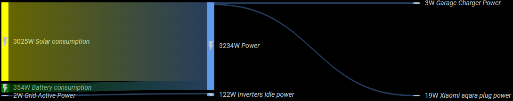

# **This project is new and under development !!!**

# Sankey Chart Card

A Home Assistant lovelace card to display a sankey chart. For example for power consumption


[![GitHub Release][releases-shield]][releases]
[![License][license-shield]](LICENSE.md)
[](https://github.com/hacs/integration)

![Project Maintenance][maintenance-shield]
[![GitHub Activity][commits-shield]][commits]



## Options

| Name              | Type    | Requirement  | Default             | Description                                 |
| ----------------- | ------- | ------------ | ------------------- | ------------------------------------------- |
| type              | string  | **Required** |                     | `custom:sankey-chart`
| sections          | list    | **Required** |                     | Entities to show divided by sections, see [sections object](#sections-object) for additional options.
| unit_prefix       | string  | **Optional** |                     | Metric prefix for the unit of measurment. See <https://en.wikipedia.org/wiki/Unit_prefix> . Supported values are m, k, M, G, T
| round             | number  | **Optional** | 0                   | Round the value to at most N decimal places.
| height            | number  | **Optional** | 200                 | The height of the card in pixels
| wide              | boolean | **Optional** | false               | Set this to true if you see extra empty space in the right side of the card. This will expand it horizontally to cover all the available space. Enable if you see empty space on the right size.
| show_icons        | boolean | **Optional** | false               | Display entity icons
| show_names        | boolean | **Optional** | false               | Display entity names

#### Sections object

| Name              | Type    | Requirement  | Default             | Description                                 |
| ----------------- | ------- | ------------ | ------------------- | ------------------------------------------- |
| entities          | list    | **Required** |                     | Entities to show in this section. Could be just the entity_id as a string or an object, see [entities object](#entities-object) for additional options. Note that the order of this list matters

#### Entities object

| Name              | Type    | Requirement  | Default             | Description                                 |
| ----------------- | ------- | ------------ | ------------------- | ------------------------------------------- |
| entity_id         | string  | **Required** |                     | Entity id of the sensor
| children          | list    | **Required** |                     | List of entity ids describing child entities (branches). Only entities from the next section will be connected.
| color             | string  | **Optional** | var(--primary-color)| Color of the box
| name              | string  | **Optional** | entity name from HA | Custom label for this entity

## Development

1. `npm i`
2. `npm start`
3. The compiled `.js` file will be accessible on
   `http://127.0.0.1:5000/ha-sankey-chart.js`.
4. On a running Home Assistant installation add this to your Lovelace `resources:`

```yaml
- url: 'http://127.0.0.1:5000/ha-sankey-chart.js'
  type: module
```

## TODO

- add example configs to README
- specify connection entities (for size of connector)
- option to throttle updates
- connections accross sections

_Change "127.0.0.1" to the IP of your development machine._

[commits-shield]: https://img.shields.io/github/commit-activity/y/MindFreeze/ha-sankey-chart.svg?style=for-the-badge
[commits]: https://github.com//MindFreeze/ha-sankey-chart/commits/master
[devcontainer]: https://code.visualstudio.com/docs/remote/containers
[license-shield]: https://img.shields.io/github/license/MindFreeze/ha-sankey-chart.svg?style=for-the-badge
[maintenance-shield]: https://img.shields.io/maintenance/yes/2022.svg?style=for-the-badge
[releases-shield]: https://img.shields.io/github/release/MindFreeze/ha-sankey-chart.svg?style=for-the-badge
[releases]: https://github.com/MindFreeze/ha-sankey-chart/releases
